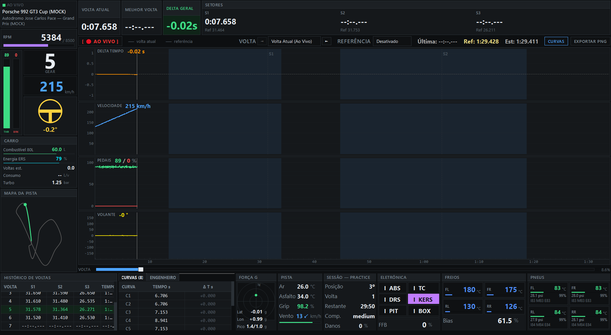
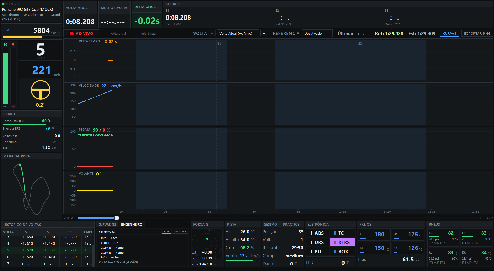
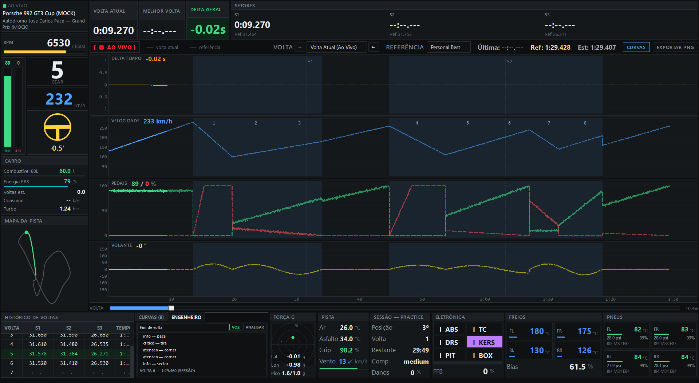
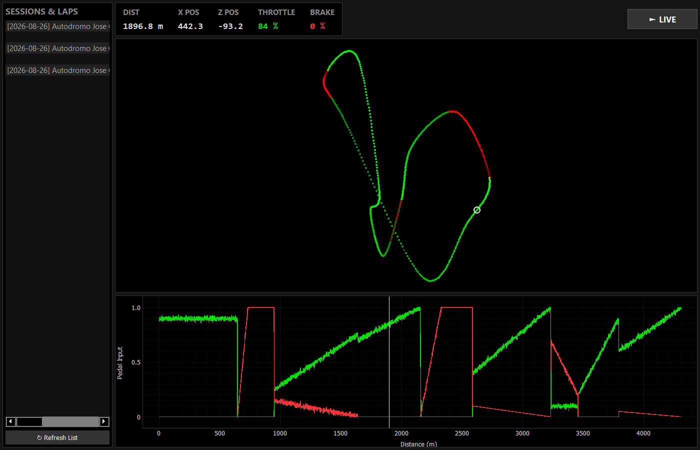
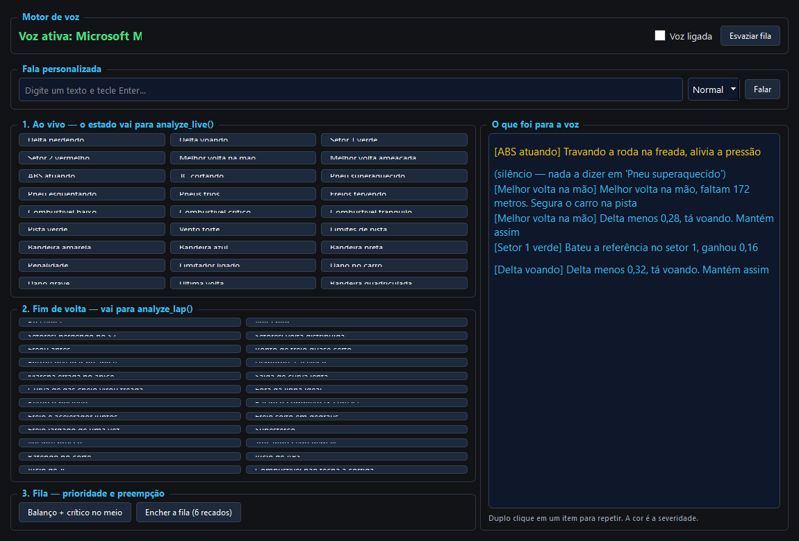
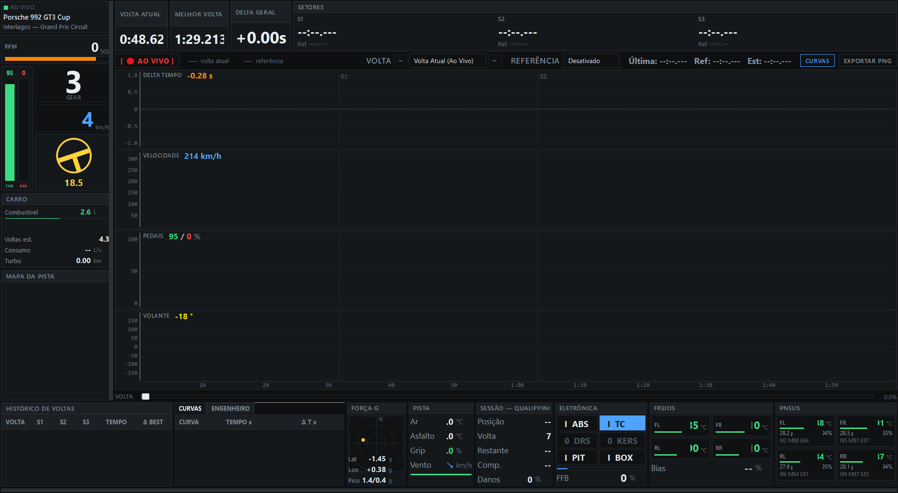

# 🏎️ ApexView — Dashboard Profissional de Telemetria e Engenheiro de Pista

> **Dashboard de telemetria em tempo real e análise de desempenho veicular para simuladores (Assetto Corsa 1), inspirado no software profissional de engenharia de automobilismo MoTeC i2 Pro.**

---

## 📌 Visão Geral do Projeto

O **ApexView** é um sistema completo de telemetria de alta performance e análise de pilotagem desenvolvido em **Python**, **PyQt5** e **PyQtGraph**. O aplicativo conecta-se diretamente à **memória compartilhada** do simulador a uma taxa de atualização de **60 Hz**, processando dados de dinâmica veicular, tempos de volta por distância interpolada, telemetria de pedais com intervenções eletrônicas, diagnóstico térmico de pneus e um **Engenheiro de Pista inteligente com síntese de voz (TTS)**.

---

## 🛠️ Tecnologias e Arquitetura

- **Linguagem & GUI:** Python 3.x, PyQt5, PyQtGraph (renderização acelerada de alta taxa de quadros).
- **Comunicação Inter-processos (IPC):** Windows Shared Memory (`mmap`, estruturas C-types binárias nativas do Assetto Corsa a 60 Hz).
- **Processamento de Sinais & Telemetria:** Interpolação contínua por distância spline, detecção de Força G lateral com histerese, cálculo de deltas dinâmicos em tempo real.
- **Motor de Engenharia & Diagnóstico:** Sistema especialista determinístico baseado em regras de pilotagem, priorização preemptiva de mensagens e análise de trail braking.
- **Síntese de Voz (TTS):** Integração com Microsoft SAPI 5 / Windows OneCore Speech API e suporte a modelos neurais de voz offline (Kokoro ONNX).
- **Persistência de Dados:** Serialização atômica JSON, controle de sessões e exportação automatizada em alta resolução.

---

## 📸 Demonstração Visual & Prints do Funcionamento

A pasta [`portfolio/prints/`](./prints) contém as capturas em alta resolução prontas para uso em portfólio, GitHub, LinkedIn e apresentações:

---

### 1. Dashboard Principal em Tempo Real (MoTeC i2 Style)


- **Pilha de 4 Gráficos Empilhados e Sincronizados:**
  - **Delta de Tempo ($\Delta t$):** Comparação instantânea em relação à volta de referência.
  - **Velocidade (km/h):** Curva contínua com escala Y dinâmica.
  - **Pedais (%):** Acelerador (Verde) e Freio (Vermelho) com realce visual exclusivo para atuação de ABS (Amarelo `#FFEA00`) e Controle de Tração (Azul Royal `#1E90FF`).
  - **Volante (°):** Ângulo real de esterçamento com régua de tempo compartilhada.
- **Sidebar Dinâmica:**
  - Mostrador de Marcha com corte de giro em alerta vermelho.
  - Velocímetro digital e conta-giros com gradiente de RPM.
  - Mostrador visual com volante rotacionando em sincronia direta com o piloto.
  - Mini-mapa 2D do circuito com posição GPS e rastro ao vivo.
- **Header de Métricas:** Cronômetro da volta atual, melhor volta registrada, delta acumulado e tempos de setores S1, S2, S3.

---

### 2. Análise Curva a Curva (Turn-by-Turn Telemetry Engine)


- **Mapeamento Automático e Manual de Circuitos:** Decomposição da pista em zonas de frenagem, contorno e saída.
- **Métricas Cruciais de Pilotagem por Curva:**
  - **Ponto de Frenagem:** Distância exata (em metros) do início do acionamento do freio.
  - **Velocidade Mínima ($V_{min}$):** Velocidade no ápice da curva comparada contra a volta de referência.
  - **Ponto de Retomada:** Metro onde o acelerador retorna a 100% de aplicação.
  - **Delta de Setor / Curva ($\Delta t$):** Identificação automática da curva crítica onde o piloto mais perdeu tempo (destacada em vermelho).

---

### 3. Engenheiro de Pista Inteligente (Diagnóstico IA & Voz)


- **Diagnósticos em Linguagem Natural:** Análise de causa raiz da perda de tempo sem alucinações (100% determinístico e local).
- **Fila com Prioridade Preemptiva:** Alertas críticos (superaquecimento, travamento, bandeiras) interrompem avisos informativos em andamento.
- **Dicas Técnicas:** Análise de *trail braking*, soltura progressiva do pedal de freio, subesterço e pontos de troca de marcha na faixa de torque ideal.

---

### 4. Comparativo Multi-Voltas & Navegação por Scrubber


- **Sobreposição de Curvas Fantasma (Ghost Lap):** Visualização simultânea da volta atual vs. Personal Best ou Volta Ideal Teórica (*Theoretical Best*).
- **Cursor Temporal e Barra de Progresso:** Inspeção ponto a ponto da pista com arrasto interativo do cursor.
- **Divisórias de Setores S1/S2/S3:** Linhas verticais dinâmicas ajustadas aos marcos oficiais da pista.

---

### 5. Dinâmica Veicular, Pneus e Gestão Eletrônica


- **Matriz Térmica de Pneus 2×2:**
  - Temperatura do núcleo, pressão em PSI e percentual de desgaste.
  - **Gradiente Térmico da Banda de Rodagem (Interna / Meio / Externa):** Alertas de divergência interna-externa $> 8^\circ\text{C}$ para ajuste de câmber.
- **Monitor de Freios:** Temperatura individual dos discos nos 4 cantos e distribuição de freio (*Brake Bias*).
- **Círculo de Atrito (Força G):** Acelerações lateral ($G_{lat}$) e longitudinal ($G_{lon}$).
- **Status dos Sistemas do Carro (I / 0):** Indicadores de prontidão e atuação de ABS, Controle de Tração (TC), DRS, KERS, limitador de pit lane e nível de Force Feedback com detecção de clipping.

---

### 6. Mapa 2D de Trajetória GPS e Telemetria Espacial


- **Reconstrução Espacial de Coordenadas:** Renderização precisa do contorno do circuito a partir de dados reais de telemetria GPS.
- **Codificação por Cores:**
  - 🟢 **Verde:** Aceleração plena / Retas.
  - 🔴 **Vermelho:** Zonas de frenagem pesada.
  - 🟡 **Âmbar:** Trechos de transição / *Coasting* / *Trail Braking*.
- **Cursor Espacial do Veículo:** Posicionamento instantâneo do carro ao longo do traçado.

---

### 7. Bancada de Testes do Engenheiro de Voz


- **Ambiente de Testes Isolado:** Simulação de cenários sintéticos de telemetria para validação de regras do engenheiro sem necessidade de abrir o simulador.
- **Gestão de Filas de Áudio:** Teste de preempção de severidade e integração com vozes Microsoft OneCore / SAPI.

---

### 8. Exportação Automática de Análise (HD PNG)


- **Exportação de Relatórios:** Geração instantânea de imagens de alta resolução ao cravar um novo recorde pessoal ou sob demanda com um único clique.

---

## 💻 Como Executar

```bash
# 1. Instalar dependências
pip install -r requirements.txt

# 2. Executar em modo Simulação / Demonstração (sem precisar do jogo)
# Altere MOCK_MODE = True em main.pyw ou execute:
python mock_game.py   # Terminal 1
python main.pyw       # Terminal 2

# 3. Executar bancada de testes de voz
python test_voice.pyw

# 4. Executar janela de mapa e trajetória GPS
python mapa.pyw
```
